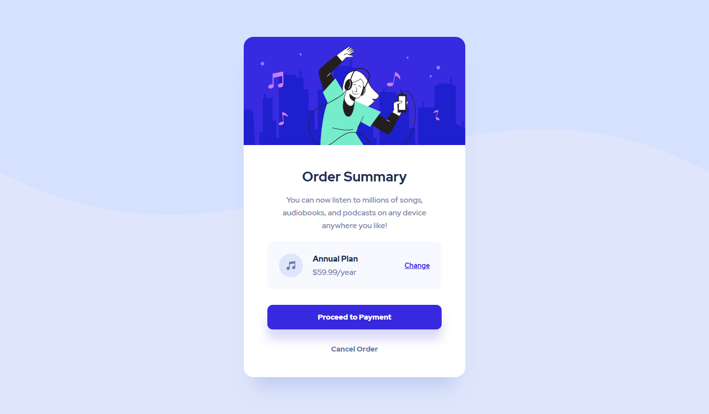

# Frontend Mentor - Order summary card solution

This is a solution to the [# Frontend Mentor - Order summary card challenge on Frontend Mentor](https://www.frontendmentor.io/challenges/order-summary-component-QlPmajDUj). Frontend Mentor challenges help you improve your coding skills by building realistic projects.

## Table of contents

- [Overview](#overview)
  - [The challenge](#the-challenge)
  - [Screenshot](#screenshot)
  - [Links](#links)
- [My process](#my-process)
  - [Built with](#built-with)
  - [What I learned](#what-i-learned)
- [Author](#author)

## Overview

### The challenge

Users should be able to:

- See hover states for interactive elements

### Screenshot

### Links

- Solution URL: (https://www.frontendmentor.io/solutions/responsive-order-summary-card-TFXa8ZDRV)
- Live Site URL: (https://lm-order-summary-component.netlify.app/)

## My process

### Built with

- Semantic HTML5 markup
- CSS custom properties/vars
- Desktop-first workflow

### What I learned

I can't lie, I learnt nothing really here. I just practiced my responsive skills and semantic HTML. One thing I did was the mobile design was designed for 375px, but I felt was very squished, so just below that breakpoint, I changed the subscription plan section with the pricing and plan to a column layout to account for even smaller screens.

## Author

- Website - [Leon Michalak](https://www.leonmichalak.tech)
- Frontend Mentor - [@NinjaInShade](https://www.frontendmentor.io/profile/NinjaInShade)
- Instagram - [@lmdeveloper](https://www.instagram.com/lmdeveloper/)
